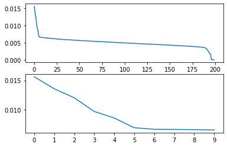
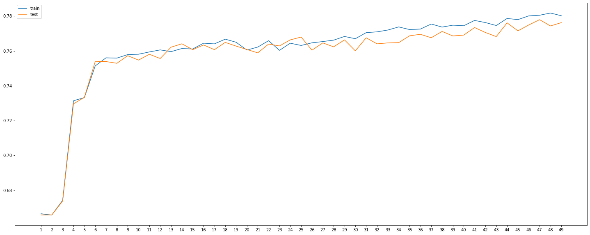
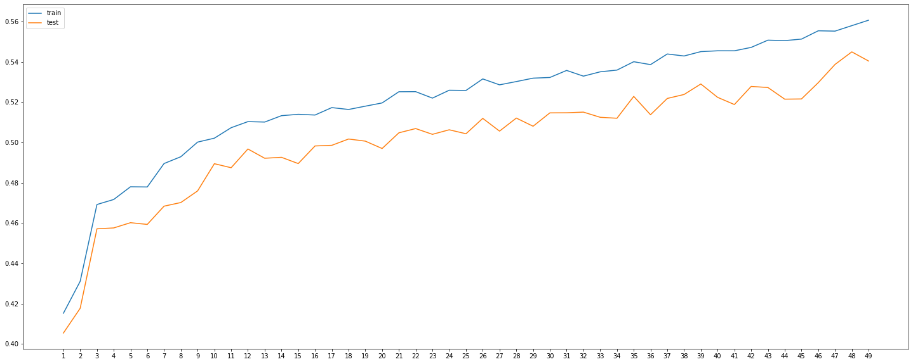

# PCA Warmup
hell yeah

## Concepts

#### Give at least two reasons why one might use PCA.  Be sure to include discussion of what problem PCA solves and how.


```python
#Your answers here
```


```python
#__SOLUTION__

'''
- dimensionality reduction.  As the number of dimensions increases, things like
distance calculations become less and less effective.  As such, we want to 
implement techniques that let us achieve around the same level of results
as including the full feature set but with a reduced number of features.

- untangling multicollinearity.  We might want to ensure that none of our features
are correlated in order to eg ease the interpretation of our model's coefficients.  
We thus want to create a set of features containing as much information as possible
but linearly independent
'''
```


```python
# Run as-is
from sklearn.datasets import make_classification
from sklearn.pipeline import Pipeline
from sklearn.decomposition import PCA
from sklearn.linear_model import LogisticRegression
from sklearn.model_selection import train_test_split
from sklearn.metrics import f1_score
from sklearn.model_selection import cross_validate
from sklearn.preprocessing import StandardScaler
import matplotlib.pyplot as plt
import numpy as np

%matplotlib inline
import pickle as pkl

with open('test_obj/X.pkl', 'rb') as f:
    X = pkl.load(f)

with open('test_obj/y.pkl', 'rb') as f:
    y = pkl.load(f)  

from test_scripts.test_class import Test
test = Test()
```


```python
#__SOLUTION__

# Run as-is
from sklearn.datasets import make_classification
from sklearn.pipeline import Pipeline
from sklearn.decomposition import PCA
from sklearn.linear_model import LogisticRegression
from sklearn.model_selection import train_test_split
from sklearn.metrics import f1_score
from sklearn.model_selection import cross_validate
from sklearn.preprocessing import StandardScaler
import matplotlib.pyplot as plt
import numpy as np

%matplotlib inline
import pickle as pkl

with open('test_obj/X.pkl', 'rb') as f:
    X = pkl.load(f)

with open('test_obj/y.pkl', 'rb') as f:
    y = pkl.load(f)  

from test_scripts.test_class import Test
test = Test()
```


```python
import pandas as pd

df_x = pd.DataFrame(X)
df_y = pd.DataFrame(y)

df_y
```


<div>
<style scoped>
    .dataframe tbody tr th:only-of-type {
        vertical-align: middle;
    }

    .dataframe tbody tr th {
        vertical-align: top;
    }

    .dataframe thead th {
        text-align: right;
    }
</style>
<table border="1" class="dataframe">
  <thead>
    <tr style="text-align: right;">
      <th></th>
      <th>0</th>
    </tr>
  </thead>
  <tbody>
    <tr>
      <td>0</td>
      <td>0</td>
    </tr>
    <tr>
      <td>1</td>
      <td>1</td>
    </tr>
    <tr>
      <td>2</td>
      <td>1</td>
    </tr>
    <tr>
      <td>3</td>
      <td>0</td>
    </tr>
    <tr>
      <td>4</td>
      <td>0</td>
    </tr>
    <tr>
      <td>...</td>
      <td>...</td>
    </tr>
    <tr>
      <td>9995</td>
      <td>0</td>
    </tr>
    <tr>
      <td>9996</td>
      <td>0</td>
    </tr>
    <tr>
      <td>9997</td>
      <td>0</td>
    </tr>
    <tr>
      <td>9998</td>
      <td>0</td>
    </tr>
    <tr>
      <td>9999</td>
      <td>1</td>
    </tr>
  </tbody>
</table>
<p>10000 rows × 1 columns</p>
</div>


## Application

### Data Exploration

- Turn `X` (a np array of features) into a dataframe.  How many features are there? 

- Turn `y` (a np array of the target) into a df.  What type of data is `y`?

- What kind of prediction problem is this?  


```python
# your work here
```


```python
#__SOLUTION__

import pandas as pd

df_x = pd.DataFrame(X)
df_y = pd.DataFrame(y)

print(df_x.head())
print(df_y[0].value_counts())
print()
print('classification! with fairly balanced classes')
```

             0           1           2           3          4          5    \
    0  55.921010   15.960047   79.847579  -74.575722  62.516598  53.176317   
    1 -73.137546  262.099610  203.580404   69.886526 -87.645923 -37.853021   
    2 -69.267421  -88.897460 -278.270517   31.852727  78.004654  43.549353   
    3  43.179196  -21.603889   68.748104 -290.428027  -7.420026  23.682904   
    4  -2.371481 -211.755001  -64.853466  148.339519 -49.650926 -46.684332   
    
              6          7          8           9    ...         190         191  \
    0  -51.041311  11.320495  41.056206  -53.242694  ...  -17.650115 -178.500520   
    1  162.116358  -6.703982 -68.917502 -113.079926  ...  146.513688  138.809206   
    2  114.118687  -7.801539   3.054873  177.264452  ...  164.909886   44.116772   
    3 -200.636222  28.736841  26.592064    0.825606  ...   38.956570   35.309093   
    4 -187.940417 -11.942910 -17.884681  100.247822  ... -357.976799  154.390629   
    
             192         193         194        195         196        197  \
    0  24.571521  -57.691007 -118.814451  96.518514 -135.794932  23.756274   
    1 -31.582876  -12.368799  123.042927   9.881037   80.389418   9.012742   
    2 -20.406617   87.463821  -31.078816 -54.469739 -155.910400  -8.145598   
    3  34.423370  161.662262   68.547606  -9.943278  103.701966 -43.998760   
    4 -34.631452  -49.448503   54.648795 -80.964527  100.676255 -24.848862   
    
              198         199  
    0  -88.186923 -154.113549  
    1 -235.405012 -114.050512  
    2  -80.744555  -70.138429  
    3   33.854567 -118.591361  
    4   84.467553   37.958813  
    
    [5 rows x 200 columns]
    0    5020
    1    4980
    Name: 0, dtype: int64
    
    classification! with fairly balanced classes


### PCA Exploration

#### Run the following steps
- TTS, `random_state` = 1

- Scale w/ StandardScaler

- For the full PCA transformation (ie, w/o specifying `n_components` number)
on `X_train`, store the explained variance ratio for each component 
in `evr`

- Graph `evr`

- Re-graph the first few components in order to focus on them (you'll see why)

How many principal components does it look like we should choose?


```python
#Your work here
```


```python
#__SOLUTION__

X_train, X_test, y_train, y_test = train_test_split(X, y, random_state=1)
pca = PCA()
ss = StandardScaler()
X_train_scld = ss.fit_transform(X_train)
X_train_pca = pca.fit_transform(X_train_scld)
cum_sum = pca.explained_variance_ratio_.cumsum()
evr = pca.explained_variance_ratio_
fig, ax = plt.subplots(2)
ax[0].plot(range(0,len(evr)), evr)
ax[1].plot(range(0,len(evr[:10])), evr[:10])
ax[1].set_xticks(range(0,len(evr[:10])))
plt.show();
```





### Calculate Train and Test Error

#### Run the following:
- for the first 50 principal components,
  - scale the data
  - generate the number of principal components and transform them into features
  - Using Logistic Regression with default inputs, generate train and test predictions through 10-fold cross validation
    - *Hint:* use `sklearn.cross_validate`
    - *Level up:* ideally, you would scale and PCA on each training fold (why?).  Use a pipeline!
  - graph the means of the train and test predictions for each number of principal component

#### Interpret the graph  
- How many principle components should we choose based on this?
- Is overfitting or underfitting a problem?

#### Level up
- Repeat the above but don't scale the data.  Intepret the results.


```python
#Your work here
```


```python
#__SOLUTION__

train_scores = []
test_scores = []

for n in range(1,50):
    pipe_all = [('scale', StandardScaler()), ('pca', PCA(n_components=n)), ('m', LogisticRegression())]

    model = Pipeline(steps=pipe_all)
    results = cross_validate(model, X_train, y_train, scoring='f1_macro', cv=10, return_train_score=True, )

    train_score = np.mean(results['train_score'])
    test_score = np.mean(results['test_score'])
    
    train_scores.append(train_score)
    test_scores.append(test_score)

fig, ax = plt.subplots(figsize=(25,10))
ax.plot(range(1, len(train_scores)+1), train_scores, label="train")
ax.plot(range(1, len(test_scores)+1), test_scores, label="test")
ax.legend()
ax.set_xticks(range(1, len(train_scores)+1))
plt.show()

print('''
If we're trying to combat overfitting, we should choose around 6 principle components, 
since that's when the gains in f1_score start to level off and overfitting starts being introduced 

If we're trying to combat underfitting, we should investigate including more than 50 principal components, 
since it seems like f1_score is still going up past the 50th component
''')

train_scores = []
test_scores = []

for n in range(1,50):
    pipe_pca = [('pca', PCA(n_components=n)), ('m', LogisticRegression())]

    model = Pipeline(steps=pipe_pca)
    results = cross_validate(model, X_train, y_train, scoring='f1_macro', cv=10, return_train_score=True, )

    train_score = np.mean(results['train_score'])
    test_score = np.mean(results['test_score'])
    
    train_scores.append(train_score)
    test_scores.append(test_score)

fig, ax = plt.subplots(figsize=(25,10))
ax.plot(range(1, len(train_scores)+1), train_scores, label="train")
ax.plot(range(1, len(test_scores)+1), test_scores, label="test")
ax.legend()
ax.set_xticks(range(1, len(train_scores)+1))
plt.show()

print('''
    The latter principal components incorporate more and more distance 
    between train error and test error as the scaling problem becomes
    worse and worse.  This results in worse and worse overfitting.
''')
```





    
    If we're trying to combat overfitting, we should choose around 6 principle components, 
    since that's when the gains in f1_score start to level off and overfitting starts being introduced 
    
    If we're trying to combat underfitting, we should investigate including more than 50 principal components, 
    since it seems like f1_score is still going up past the 50th component
    





    
        The latter principal components incorporate more and more distance 
        between train error and test error as the scaling problem becomes
        worse and worse.  This results in worse and worse overfitting.
    


```python

```
